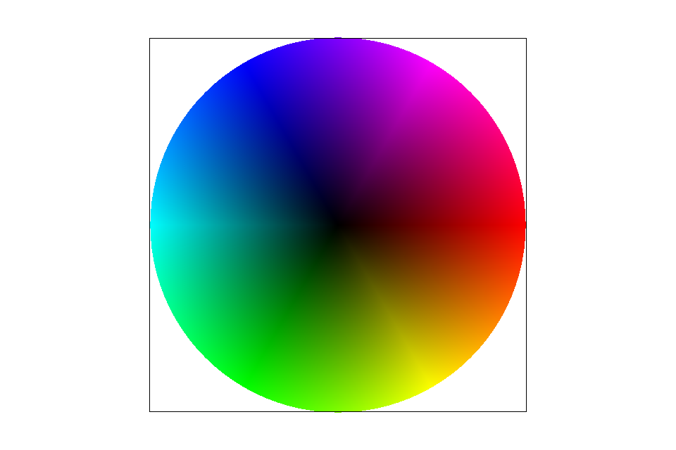

<!-- 
Document parsed with Kramdown: https://kramdown.gettalong.org/
Plots made with plot.ly: https://plot.ly/javascript/
Stylesheet from https://thomasf.github.io/solarized-css/
Magnifier from https://github.com/okfocus/okzoom
Kramdown tips from https://about.gitlab.com/2016/07/19/markdown-kramdown-tips-and-tricks/
-->

<!-- Scripts -->

<!-- Stylesheets and CSS -->
<link href="./stylesheets/solarized-dark.css" rel="stylesheet">

<!-- HTML -->

# CS 184: Computer Graphics and Imaging, Spring 2018

## Project 1: Rasterizer

#### Tushar Singal, CS184-adb

## Overview

In this project, I worked on the toolchain that takes a mathematical and continuous interpretation of geometry and maps it to a real-world system - pixel-based displays. Throughout this project, I learnt how to map triangles to screens so that they may sum to larger polygons. I further learnt basic linear algebra techniques to perform rotations, translations, and scales. Challenges this project involved consisted of learning how to optimize this representation to the not wholly-accurate nature of pixel-based displays, requiring techniques such as antialiasing via supersampling, mipmapping, and filtering to remove artefacts. 

***Extra Credit:*** Much of my focus was on optimizing these algorithms, both algorithmically (via faster triangle-fill methods) and physically (using parallelism and optimizing both cache efficiency and cache locality.)

***Notes:*** 
{: .warning}

* This document loads scripts from the web. Please make sure you are viewing this document with Javascript and internet access.
* This document relies on MathJax. If you can see $$this$$, then your MathJax is working. If you can't see that, refresh or switch browsers.
* Hover over an image to zoom!
{: .warning}

## Section I: Rasterization

### Part 1: Rasterizing single-color triangles

##### Unoptimized

**Runtime: O(triangle size)**

The first part of our project involves *rasterizing* triangles - in essence, drawing triangles to the screen. Given three coordinates, we construct an equation for the triangles: 

$$
    L_i(x, y) = A_ix + B_iy + C_i \\

	L(x, i) = \left\{\begin{array}{lr}
	    = 0: & \text{on triangle edge}\\
	    \lt 0: & \text{outside edge}\\
	    \gt 0: & \text{inside edge}
	    \end{array}\right\}
$$

The unoptimized algorithm involves taking $$max(\text{all triangle } (x, y) \text{ endpoints})$$ and $$min(\text{all triangle } (x, y) \text{ endpoints})$$ to create a bounding box that is both as long as the triangle as it is wide.

We then iterate over each pixel in this $$\text{width} \times \text{height}$$ box to test if the pixel's center (offset of $$+0.5$$) is in the box. If it is, we render that pixel.

Below, I've compared this brute-forced unoptimized solution to the final, optimized solution. As we proceed, I will show what steps we take to arrive at the final solution.

The unoptimized solution computes every black pixel seen here:

{:id: class="center-img"}

Once we add in colors, we can see what the rendered triangles look like:

{:id: class="center-img"}

##### Physical Optimization (Extra Credit): `uint_fast8_t`

When storing colors and pixels, it's a bad idea to use `int`s due to how much space they use. A particular datatype, `uint_fast8_t`, is a better choice, because we only need to store 256 colors per value. I additionally used `uint_fast16_t` in other locations where values between $$[1, 2^{16} - 1]$$ would suffice.

We get an almost 20% improvement, likely from better cache usage (each color uses almost 1/4th of its original space.)

##### Physical Optimization (Extra Credit): Optimized `for`-loops

If we take a look at the staff code, we see various loops of the form

{:.c++}
    for (int x = 0; x < width; ++x) {
      for (int y = 0; y < height; ++y) {

These sort of loops are bad for cache locality. The reason is that we are iterating over *rows* rather than *columns*. Normally, when an element is loaded from cache, the ones adjacent to it are loaded too. But the staff code proceeds to check the next row instead of the elements adjacent to the current element.

Re-ordering this to utilize cache locality can result in significant speedups:

{:.c++}
    for (int y = 0; y < height; ++y) {
      for (int x = 0; x < width; ++x) {

The speedup is graphed below.

**We've acheived a total speedup of about 75% so far, without even using any algorithmic optimizations!** And, as we can see, using `uint_fast8_t` as discussed previously has an even larger effect when used in conjunction with these cache optimizations.

##### Physical Optimization (Extra Credit): Parallelism

This method of rasterization is known as "embarassingly parallel" - in essence, every render operation is independent of others, allowing us to easily parallelize render calls across rows.

I used [OpenMP](http://www.openmp.org/) to parallelize both the staff's `DrawRend::resolve` function and my own `DrawRend::rasterize_triangle` function. I ran on 20 threads, or 10 cores (on an [Intel i7-7900X](https://ark.intel.com/products/123613/Intel-Core-i9-7900X-X-series-Processor-13_75M-Cache-up-to-4_30-GHz)).

The speedups, despite being limited by [Amdahl's Law](https://en.wikipedia.org/wiki/Amdahl%27s_law), are still quite massive. **We have acheived a 300% speedup over our unoptimized solution and a 130% speedup over our previous most optimized solution (for loops + `uint_fast8_t`)!** Impressively, this level of optimization at 16 supersampling samples is *faster than the default solution at 1 sample!*

One does not simply parallelize everything; we must make sure to avoid cache thrashing and limit our threads accordingly. (Cache thrashing occurs when the same thread is accessing completely different locations in memory consistently.)

In fact, I also noticed cache thrashing when removing `uint_fast8_t` from this parallel solution - there would be extremely large variance in results, likely due to the fact that adjacent colors would be less likely to fit on a thread's cache.

##### Algorithmic Optimization (Extra Credit): Using Triangle Intercepts

It turns out that iterating over the entire bounding box of the triangle is an absurdly wasteful solution. With a bit of thought, we can iterate **only over the pixels contained within the triangle** and nothing more. 

The key lies in determining the minimum and maximum x-intercept of the triangle at each row. These values will tell us which locations we must fill in; we can ignore everything else. 

The speedup over our previous optimizations are mininmal. As we can see, algorithmic optimizations are not everything. Paying close attention to what the code is doing, down to the silicon, is critical. I noticed that my CPU was not using anywhere close to its full potential, hinting at further issues with cache and I/O in the base code.

Regardless, we have hit a **very satisfying 4.5x speedup** compared to our base solution. These optimizations will pay dividends throughout the rest of the project.

### Part 2: Antialiasing Triangles

Supersampling was implemented by evenly spacing $$n^2$$ samples in a grid inside a pixel. Widths between each pixel were dynamically generated; each pixel must be spaced $$1 - \frac{n}{n+1}$$ pixels horizontally and vertically from one another.

Once each sample was taken, all $$n^2$$ samples were averaged together to produce a shaded pixel.

Results can be seen as follows:

{:id: class="center-img"}
1 Sample
{:.caption}

{:id: class="center-img"}
4 Samples
{:.caption}

{:id: class="center-img"}
9 Samples
{:.caption}

{:id: class="center-img"}
16 Samples
{:.caption}

### Part 3: Transforms

Implementing transforms was relatively simple, each $$3 \times 3$$ matrix was relatively straightforward. Behold, I show my masterpiece: A robot bending its knees.

{:id: class="center-img"}
My incredible work of art
{:.caption}

## Section II: Sampling

### Part 4: Barycentric coordinates

This part involved implementing barycentric coordinates. In my own words, I would say that barycentric coordinates are a "cooridnate space for triangles" - given valid barycentric coordinates, we can tell exactly where we are in a triangle given only its endpoints and weights.

Weighting a cooridnate, then, "drags" us in the direction of that coordinate. The lecture slide below describes this adeptly.

{:id: class="center-img"}
In this lecture slide, we see that that $$\alpha = 1$$, $$\beta = 0$$, and $$\gamma = 0$$.
{:.caption}

Below, we can see my successful implementation of barycentric cooridnates being used to shade a circle made of triangles.

{:id: class="center-img"}
Barycentric coordinates being used to make a rainbow circle.
{:.caption}

### Part 5: "Pixel sampling" for texture mapping

Pixel sampling is useful for when our pixel centers do not perfectly align and match the size of the texture we are trying to display. In other words, when a sample lies between points on a texture, we must ask the question: "What parts of the texture should play a role in this sample?" When thinking about which sampling method to choose, we must consider the frequency of changes in the texture against any performance limitations we might have.

The two methods implemented in this part - *bilinear* and *nearest neighbor* - serve different purposes, both of which I describe below.

##### Nearest Neighbor Sampling

Nearest neighbor will take the closest pixel sample - this will often result in a "pixelated" image, as there's not much in the way of blending nearby pixels. For similar reasons, nearest neighbor will fail in images with high frequency, potentially resulting in moire patterns.

{:id: class="center-img"}
Nearest-pixel sampling with 1 supersampling sample. Note the fast changes in Florida's texture and the lack of blending in the gridlines due to high-frequency texture content being inoptimally mapped to the screen. 
{:.caption}

{:id: class="center-img"}
Nearest-pixel sampling with 16 supersampling samples. The supersampling effectively eliminates some of the high-frequency content and makes the image smoother and more palatable.
{:.caption}

##### Bilinear Sampling

Bilinear sampling, on the other hand, will weight the four closest pixels to our sample point by linearly interpolating between them until it reaches a weighted blend of all four colors. Naturally, this is less susceptible to moire, as it is a similar concept to supersampling - *we're reducing higher-frequency content rather than simply sampling from it.*

For this reason, large differences will be especially visible in textures with high-frequency content, especially when it is being sampled at a fraction of its true size.

{:id: class="center-img"}
Bilinear interpolation with one sample performs similarly to nearest-pixel sampling with 16 samples, for much the same reason regarding reduction in high-frequency content. Note how the changes in texture content are less sharp than nearest-pixel sampling.
{:.caption}

{:id: class="center-img"}
We get an even smoother (almost unnecessarily so) rendering of the image when combining bilinear interpolation with 16 samples. Texture sharpness is further reduced, and we can see the red dotted line start to fade away.
{:.caption}

### Part 6: "Level sampling" with mipmaps for texture mapping

It often happens that we simply "skip" too much texture content from pixel to pixel. This is likely, for example, when rendering a videogame texture that's far away, or when we're facing a 3D model where one polygon stretches along the side. Essentially, our "pixel footprint" over the texture simply becomes too large. While supersampling and bilinear interpolation often help mitigate the problem, aliasing artefacts can still occur. A better solution - *mipmapping* - drastically reduces the performance impact, allowing us to preserve a necessary level of detail while avoiding aliasing artefacts.

Mipmapping involves creating different "levels" of the texture, where each progressive level is downsampled by a factor of two. Thus, as our "pixel footprint" increases, we can simply increase our mipmap level to sample from a texture that matches our current footprint, as the course lecture slides below illustrate. Because mipmaps are stored, we don't have to recompute them every time, and the nature of mipmapping (i.e. reducing high-frequency texture content where necessary) makes it possible for us to choose lower-intensity supersampling and filtering methods.

{:id: class="center-img"}
We sample from a texture downsampled $$D$$ times.
{:.caption}

For example, if the entire texture maps to the space of one pixel, it would be appropriate to use the highest mipmap level (a $$1 \times 1$$ texture). However, if one pixel spans less than one unit in texture space, we wouldn't mipmap at all.

{:id: class="center-img"}
If the entire graph took up 1 pixel on our screen, it would be appropriate use mipmap level 7. As the texture takes up more space on our screen, we move down mipmap levels.
{:.caption}

There are two types of mipmapping - *nearest* and *linear*. I'll describe them below.

##### Mipmapping - Nearest Level

Nearest-level mipmapping simply finds the closest level based off of the equations above and maps each pixel to its closest level. This can result in sharp changes between textures as we switch mipmap levels.

{:id: class="center-img"}
Because nearest-level mipmapping maps every pixel to its nearest mipmap level, we can have sharp differences in texture. Here, shades of green show different mipmap levels.
{:.caption}

##### Mipmapping - Linear

More complex, linear mipmapping linearly interpolates between different mipmap levels. For example, if our distance measure $$D = log_2L$$ for some pixel $$j$$ is $$D_j = 2.3$$, we would take $$1 - 0.3 = 0.7$$ times mipmap level 2 (because we are $$0.7$$ "closer" to level 2 than we are to level 3), and $$0.3$$ times mipmap level 3. This creates a much smoother texture gradient, as seen below.

Linear mipmapping doesn't take much longer than nearest, because it's simply an additional multiply and texture fetch operation.

{:id: class="center-img"}
Linear mipmapping linearly interpolates between mipmap levels, creating a smooth gradient, as opposed to the crude, stepping gradient of nearest-level mipmapping.
{:.caption}

##### Mipmapping - Examples

To take a look at the interplay between mipmapping and pixel interpolation, I'll use the texture below.

{:id: class="center-img"}
This texture will be used to illustrate the difference between mipmap levels.
{:.caption}

{:id: class="center-img"}
**Zero Level - Nearest Interpolation:** With no form of downsampling or high-frequency reduction, we can see some jaggies in the road and some aliasing. 
{:.caption}

{:id: class="center-img"}
**Zero Level - Bilinear Interpolation:** Looking at the topmost road in the zoom, we see that bilinear interpolation has smoothed it out a bit, but it's still a bit jaggy and noisy.
{:.caption}

{:id: class="center-img"}
**Nearest Level - Nearest Interpolation:** Nearest level has solved all of our jaggies, as the road area is from a heavily downsampled texture.
{:.caption}

{:id: class="center-img"}
**Nearest Level - Bilinear Interpolation:** Bilinear interpolation is, perhaps, a bit too much, as now we're combining pixels from a downsampled/blurred textures with its downsampled/blurred neighbors.
{:.caption}

